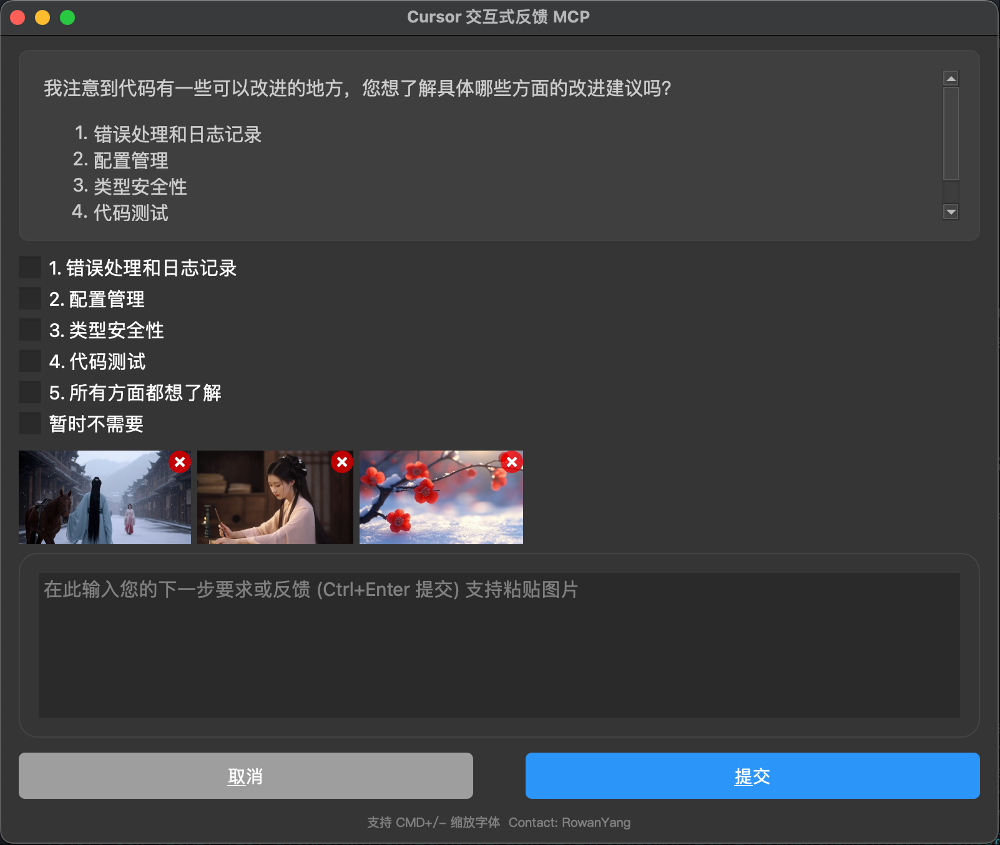

[English](./README.en.md)

# 🗣️ 让 cursor 的 500 次请求变成 2500 次 —— 交互式反馈 MCP

一个可以在 [Cursor](https://www.cursor.com)、[Cline](https://cline.bot) 和 [Windsurf](https://windsurf.com) 等 AI 辅助开发工具中启用人机协作（human-in-the-loop）的工作流程。该服务器允许您直接向 AI 代理提供反馈，弥合了 AI 与您之间的差距。

通过这种交互式反馈，您可以在 cursor 完成任务之前，之中，之后，向用户提供反馈，获取更详细的上下文从而减少 cursor 次数浪费，实现 500 次当 2500 次用。

**注意：** 该服务器设计为与 MCP 客户端（例如 Claude Desktop、VS Code）一起在本地运行，因为它需要直接访问用户的操作系统以显示通知。

## 新增功能

- 美化了弹框样式
- 支持粘贴图片
- 支持 markdown 格式

## 🖼️ 示例



## 💡 为什么使用这个？

在 Cursor 这样的环境中，您发送给 LLM 的每一个提示都被视为一个独立请求——每个请求都会计入您的月度限额（例如 500 个高级请求）。当您根据模糊的指令进行迭代或纠正误解的输出时，这会变得低效，因为每个后续澄清都会触发一个全新的请求。

这个 MCP 服务器引入了一个解决方案：它允许模型在最终确定响应之前暂停并请求澄清。模型不会完成请求，而是触发一个工具调用 (`interactive_feedback`)，该调用会打开一个交互式反馈窗口。然后，您可以提供更多细节或要求更改——模型将继续会话，所有这些都在单个请求中完成。

其本质上，这只是巧妙地利用工具调用来延迟请求的完成。由于工具调用不计为单独的高级交互，因此您可以在不消耗额外请求的情况下循环进行多个反馈周期。

本质上，这有助于您的 AI 助手**寻求澄清而不是猜测**，而不会浪费另一个请求。这意味着更少的错误答案、更好的性能和更少的 API 使用浪费。

- **💰 减少高级 API 调用：** 避免浪费昂贵的 API 调用来根据猜测生成代码。
- **✅ 更少错误：** 在行动之前进行澄清意味着更少的错误代码和浪费的时间。
- **⏱️ 更快的周期：** 快速确认胜过调试错误的猜测。
- **🎮 更好的协作：** 将单向指令变成对话，让您掌控会话什么时候结束。

## 🛠️ 工具

该服务器通过模型上下文协议 (MCP) 暴露了以下工具：

- `interactive_feedback`：向用户提问并返回用户的答案。可以显示预设选项。

## 📦 安装

1.  **先决条件：**
    - Python 3.10+
    - [uv](https://github.com/astral-sh/uv) (Python 包管理器)。使用以下命令安装：
      - Windows: `pip install uv`
      - Linux: `curl -LsSf https://astral.sh/uv/install.sh | sh`
      - macOS: `brew install uv`
2.  **获取代码：**
    - 克隆此仓库：
      `git clone https://github.com/kele527/interactive-feedback-mcp.git`

## ⚙️ 配置

1. 在您的 `claude_desktop_config.json` (Claude Desktop) 或 `mcp.json` (Cursor) 中添加以下配置：
   **请记住将 `/path/to/interactive-feedback-mcp` 路径更改为您系统中克隆仓库的实际路径。**

```json
{
  "mcpServers": {
    "interactive-feedback": {
      "command": "uv",
      "args": ["--directory", "[这里改成你的路径]/interactive-feedback-mcp", "run", "server.py"],
      "timeout": 600,
      "autoApprove": ["interactive_feedback"]
    }
  }
}
```

如果无法成功启动，复制下图中的命令，在终端中执行，看看报什么错误，一般是 python 安装相关。


2. 在您的 AI 助手（在 Cursor Settings > Rules > User Rules 中）的全局自定义规则中添加以下内容：

> If requirements or instructions are unclear use the tool interactive_feedback to ask clarifying questions to the user before proceeding, do not make assumptions. Whenever possible, present the user with predefined options through the interactive_feedback MCP tool to facilitate quick decisions.

> Whenever you're about to complete a user request, call the interactive_feedback tool to request user feedback before ending the process. If the feedback is empty you can end the request and don't call the tool in loop.

这将确保 cursor 在你提问的问题不明确时以及在将任务即将完成之前始终使用此 MCP 服务器来请求用户反馈。

## 🙏 致谢

由 Fábio Ferreira ([@fabiomlferreira](https://x.com/fabiomlferreira)) 开发。

由 Pau Oliva ([@pof](https://x.com/pof)) 在 Tommy Tong 的 [interactive-mcp](https://github.com/ttommyth/interactive-mcp) 的启发下进行了增强。

用户界面由 kele527 ([@kele527](https://x.com/jasonya76775253)) 优化

